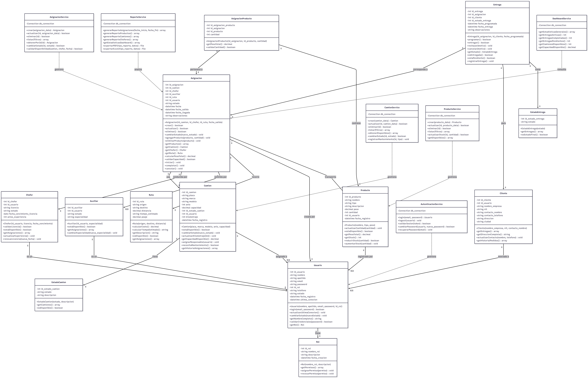

# Proyecto Integrador - Transportes RBL

**Integrantes**

Jean Paul Rojas Herrera

Daniel Sundar Bonilla Bolaños

Michael Dowglas Lenis Chagüendo

**Docentes**

Gabriel Pérez Moreno

Oscar Alberto Soto Piedrahita

Tania Isadora Mora Pedrero

- - -

**Institución Universitaria Antonio José Camacho**

Facultad de Ingenierías - Tecnología en Sistemas de Información

Cali, Colombia

2026

## Tabla de contenidos

- [Planteamiento del problema](#planteamiento-del-problema)
- [Pregunta de investigación](#pregunta-de-investigación)
- [Objetivos](#objetivos)
- [Justificación](#justificación)
- [Diagrama de clases](#diagrama-de-clases)

## Planteamiento del problema

La empresa Transportes RBL se especializa en el transporte de mercancías para dos proveedores clave, cada uno con características y demandas particulares que requieren una gestión precisa del inventario para los camiones de la empresa y actualización de información acerca de la entrega de los productos.

| Proveedor | Productos |
|-----------|-----------|
| **Haceb** | Electrodomésticos: neveras, estufas, lavadoras, microondas |
| **Ajover Darnel** | Sector alimentario: icopor, jugos, envases plásticos |

Actualmente, la operación diaria se efectúa con una flota de 3 camiones, a los que se asignan 2 trabajadores por unidad para la carga y descarga. Cada camión posee una capacidad de carga expresada en volumen:

| Camión | Conductor | Capacidad |
|--------|-----------|-----------|
| Camión 1 | Stiven  | 20.25 m³  |
| Camión 2 | Edward  | 33.75 m³  |
| Camión 3 | David   | 16.94 m³  |

Sin embargo, la planificación de la logística aún se gestiona de forma manual, lo que ocasiona dificultades como:

- **Falta de control en las rutas:** la asignación de recorridos depende de los conocimientos de los conductores, generando ineficiencias y falta de estandarización.
- **Escasa trazabilidad de los productos:** no existe un sistema que permita identificar los productos que lleva cada camión ni el estado de entrega de estos.
- **Ausencia de información de las entregas:** los clientes y coordinadores logísticos no cuentan con mecanismos digitales que puedan informar sobre el progreso de las entregas.

## Pregunta de investigación

> ¿Cómo mejorar la planificación de rutas, el control de productos y el seguimiento de entregas en la empresa Transportes RBL mediante el desarrollo de soluciones tecnológicas?

## Objetivos

### Objetivo general

- Desarrollar un sistema de información que permita a la empresa de Transportes RBL automatizar sus procesos de planificación en el transporte de carga de los productos de sus clientes, establecimiento de sus rutas óptimas, asignación de los vehículos y personal a cargo del cargue, descargue y conducción, así como el seguimiento y trazabilidad de entregas, desde su origen hasta su destino final.

### Objetivos específicos

- Implementar un módulo que permita registrar y gestionar los usuarios del sistema, definir roles (administrador, coordinador, conductor y cliente) y configurar las opciones básicas de funcionamiento del sistema.
- Implementar funcionalidades para registrar y administrar la información relacionada con productos, vehículos y pedidos, permitiendo almacenar y organizar los datos de las operaciones logísticas de forma digital.
- Permitir el monitoreo y actualización del estado de los pedidos durante el proceso de entrega, facilitando la consulta del estado de cada envío y el control de las rutas asignadas.
- Generar reportes y consultas sobre las operaciones logísticas realizadas, permitiendo visualizar información histórica de entregas, productos y estados de pedidos para apoyar la toma de decisiones.

## Justificación

El desarrollo de un software a medida para Transportes RBL es clave debido a la necesidad de modernizar y digitalizar la gestión logística de la empresa. Actualmente, los procesos manuales no ofrecen la precisión ni la eficiencia que demanda el mercado actual.

Este proyecto se justifica por cuatro razones fundamentales:

| # | Razón | Descripción |
|---|-------|-------------|
| 1 | **Adaptación a las necesidades operativas** | El software se desarrollará con base en las características reales de la empresa –como los camiones disponibles, los productos transportados y frecuencia de viajes–, asegurando así una solución completamente personalizada y eficiente. |
| 2 | **Escalabilidad y sostenibilidad** | Al ser un desarrollo propio, el sistema podrá evolucionar en conjunto con la empresa, ajustándose a nuevas rutas, clientes o cambios operativos, sin las limitaciones que imponen las plataformas comerciales. |
| 3 | **Reducción de dependencia externa** | El control total sobre el software elimina la necesidad de licencias o soporte de terceros, lo que reduce costos y fortalece la autonomía tecnológica de la empresa. |
| 4 | **Mejora en la toma de decisiones** | La generación automática de informes y estadísticas permitirá a la gerencia tomar decisiones estratégicas respaldadas en datos precisos, superando las limitaciones de los métodos manuales o genéricos. |

## Diagrama de clases

El diagrama de clases del sistema se encuentra documentado en detalle en el siguiente archivo:

👉 [Ver diagrama de clases](diagrama-clases.md)