# Diagrama de Clases (Mermaid) — Transportes RBL

Este diagrama representa la arquitectura de clases del sistema de información para la empresa Transportes RBL, incluyendo entidades, servicios y sus relaciones.

```mermaid
classDiagram
    class Usuario {
        -int id_usuario
        -string nombre
        -string apellido
        -string email
        -string password
        -int id_rol
        -string telefono
        -string estado
        -datetime fecha_registro
        -datetime ultima_conexion
        +Usuario(nombre, apellido, email, password, id_rol)
        +login(email, password) boolean
        +actualizarUltimaConexion() void
        +cambiarEstado(nuevoEstado) void
        +getNombreCompleto() string
        +validarCredenciales(password) boolean
        +getRol() Rol
    }
    
    class Rol {
        -int id_rol
        -string nombre_rol
        -string descripcion
        -datetime fecha_creacion
        +Rol(nombre_rol, descripcion)
        +getPermisos() array
        +asignarPermiso(permiso) void
        +revocarPermiso(permiso) void
    }
    
    class Chofer {
        -int id_chofer
        -int id_usuario
        -string licencia
        -string estado
        -date fecha_vencimiento_licencia
        -int anios_experiencia
        +Chofer(id_usuario, licencia, fecha_vencimiento)
        +validarLicencia() boolean
        +estaDisponible() boolean
        +getAsignaciones() array
        +actualizarExperiencia() void
        +renovarLicencia(nueva_fecha) void
    }
    
    class Auxiliar {
        -int id_auxiliar
        -int id_usuario
        -string estado
        -string especialidad
        +Auxiliar(id_usuario, especialidad)
        +estaDisponible() boolean
        +getAsignaciones() array
        +cambiarEspecialidad(nueva_especialidad) void
    }
    
    class Camion {
        -int id_camion
        -string placa
        -string marca
        -string modelo
        -int anio
        -decimal capacidad
        -int id_estado_camion
        -int id_usuario
        -int kilometraje
        -datetime fecha_registro
        +Camion(placa, marca, modelo, anio, capacidad)
        +estaDisponible() boolean
        +cambiarEstado(nuevo_estado) void
        +actualizarKilometraje(km) void
        +getCapacidadDisponible() decimal
        +asignarResponsable(usuario) void
        +necesitaMantenimiento() boolean
        +getHistorialAsignaciones() array
    }
    
    class EstadoCamion {
        -int id_estado_camion
        -string estado
        -string descripcion
        +EstadoCamion(estado, descripcion)
        +getCamiones() array
        +esDisponible() boolean
    }
    
    class Ruta {
        -int id_ruta
        -string origen
        -string destino
        -decimal distancia
        -string tiempo_estimado
        -decimal peaje
        +Ruta(origen, destino, distancia)
        +calcularCosto() decimal
        +calcularTiempoEstimado() string
        +getDescripcion() string
        +esDisponible() boolean
        +getAsignaciones() array
    }
    
    class Producto {
        -int id_producto
        -string nombre
        -string tipo
        -string descripcion
        -decimal peso
        -int cantidad
        -int id_usuario
        -datetime fecha_registro
        +Producto(nombre, tipo, peso)
        +actualizarCantidad(cantidad) void
        +estaDisponible() boolean
        +getPesoTotal() decimal
        +getStock() int
        +reducirStock(cantidad) boolean
        +aumentarStock(cantidad) void
    }
    
    class Cliente {
        -int id_cliente
        -int id_usuario
        -string nombre_empresa
        -string nit
        -string contacto_nombre
        -string contacto_telefono
        -string direccion
        -string ciudad
        +Cliente(nombre_empresa, nit, contacto_nombre)
        +getEntregas() array
        +getDireccionCompleta() string
        +actualizarContacto(nombre, telefono) void
        +getHistorialPedidos() array
    }
    
    class Asignacion {
        -int id_asignacion
        -int id_camion
        -int id_chofer
        -int id_auxiliar
        -int id_ruta
        -int id_usuario
        -string estado
        -datetime fecha
        -datetime fecha_salida
        -datetime fecha_llegada
        -string observaciones
        +Asignacion(id_camion, id_chofer, id_ruta, fecha_salida)
        +crear() boolean
        +actualizar() boolean
        +eliminar() boolean
        +cambiarEstado(nuevo_estado) void
        +agregarProducto(producto, cantidad) void
        +eliminarProducto(producto) void
        +getProductos() array
        +getCamion() Camion
        +getChofer() Chofer
        +getRuta() Ruta
        +calcularPesoTotal() decimal
        +validarCapacidad() boolean
        +iniciar() void
        +completar() void
        +cancelar() void
    }
    
    class AsignacionProducto {
        -int id_asignacion_producto
        -int id_asignacion
        -int id_producto
        -int cantidad
        +AsignacionProducto(id_asignacion, id_producto, cantidad)
        +getPesoTotal() decimal
        +validarCantidad() boolean
    }
    
    class Entrega {
        -int id_entrega
        -int id_asignacion
        -int id_cliente
        -int id_estado_entrega
        -datetime fecha_programada
        -datetime fecha_entrega
        -string observaciones
        +Entrega(id_asignacion, id_cliente, fecha_programada)
        +programar() boolean
        +entregar() boolean
        +rechazar(motivo) void
        +cancelar(motivo) void
        +getEstado() EstadoEntrega
        +esEntregada() boolean
        +estaPendiente() boolean
        +registrarEntrega() void
    }
    
    class EstadoEntrega {
        -int id_estado_entrega
        -string estado
        +EstadoEntrega(estado)
        +getEntregas() array
        +esEstadoFinal() boolean
    }
    
    class AutenticacionService {
        -Connection db_connection
        +login(email, password) Usuario
        +logout(usuario) void
        +validarSesion(token) boolean
        +cambiarPassword(usuario, nueva_password) boolean
        +recuperarPassword(email) void
    }
    
    class AsignacionService {
        -Connection db_connection
        +crear(asignacion_data) Asignacion
        +actualizar(id, asignacion_data) boolean
        +eliminar(id) boolean
        +listar(filtros) array
        +obtenerPorId(id) Asignacion
        +cambiarEstado(id, estado) boolean
        +validarDisponibilidad(camion, chofer, fecha) boolean
    }
    
    class CamionService {
        -Connection db_connection
        +crear(camion_data) Camion
        +actualizar(id, camion_data) boolean
        +eliminar(id) boolean
        +listar(filtros) array
        +obtenerDisponibles() array
        +cambiarEstado(id, estado) boolean
        +registrarMantenimiento(id, tipo) void
    }
    
    class ProductoService {
        -Connection db_connection
        +crear(producto_data) Producto
        +actualizar(id, producto_data) boolean
        +eliminar(id) boolean
        +listar(filtros) array
        +actualizarStock(id, cantidad) boolean
        +getDisponibles() array
    }
    
    class ReporteService {
        -Connection db_connection
        +generarReporteAsignaciones(fecha_inicio, fecha_fin) array
        +generarReporteProductos() array
        +generarReporteCamiones() array
        +generarReporteChoferes() array
        +getEstadisticasDashboard() array
        +exportarPDF(tipo_reporte, datos) file
        +exportarExcel(tipo_reporte, datos) file
    }
    
    class DashboardService {
        -Connection db_connection
        +getEstadisticasGenerales() array
        +getEntregasActivas() int
        +getEntregasCompletadas() int
        +getEntregasPendientes() int
        +getCamionesDisponibles() int
        +getCapacidadDisponible() decimal
    }
    
    %% Relaciones
    Usuario "n" --> "1" Rol : tiene
    Chofer "1" --> "1" Usuario : es un
    Auxiliar "1" --> "1" Usuario : es un
    Camion "n" --> "1" EstadoCamion : tiene
    Camion "n" --> "0..1" Usuario : asignado a
    Asignacion "n" --> "1" Camion : usa
    Asignacion "n" --> "1" Chofer : conducida por
    Asignacion "n" --> "0..1" Auxiliar : asistida por
    Asignacion "n" --> "1" Ruta : recorre
    Asignacion "n" --> "1" Usuario : creada por
    AsignacionProducto "n" --> "1" Asignacion : pertenece a
    AsignacionProducto "n" --> "1" Producto : contiene
    Asignacion "n" -- "n" Producto : transporta
    Entrega "n" --> "1" Asignacion : corresponde a
    Entrega "n" --> "1" Cliente : para
    Entrega "n" --> "1" EstadoEntrega : tiene
    Cliente "n" --> "0..1" Usuario : asociado a
    Producto "n" --> "0..1" Usuario : registrado por
    
    %% Servicios
    AutenticacionService ..> Usuario : gestiona
    AsignacionService ..> Asignacion : gestiona
    CamionService ..> Camion : gestiona
    ProductoService ..> Producto : gestiona
    ReporteService ..> Asignacion : analiza
    DashboardService ..> Asignacion : consulta
```

[← Volver al README](README.md)

